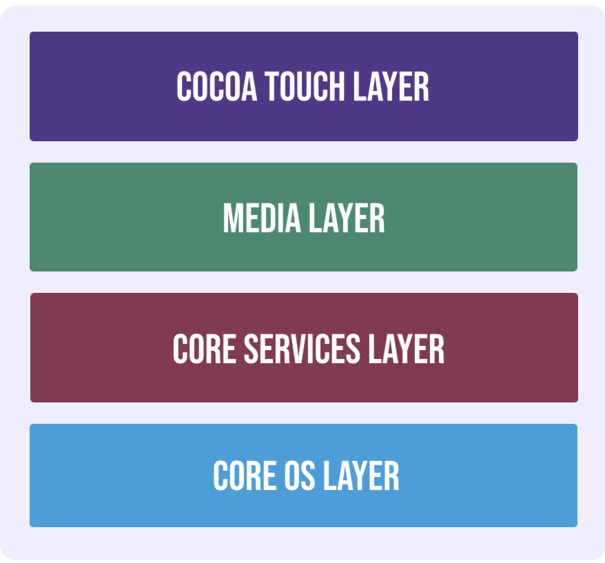

**Published by Arunprasadh C on 19 Apr 2022** • *Last Updated on 19 Apr 2022*

## iOS Architecture
The general architecture of iOS consists of four layers as shown below:

### Core OS Layer
All the iOS technologies are build on the low level features provided by the Core OS layer. These technologies include Core Bluetooth Framework, External Accessory Framework, Accelerate Framework, Security Services Framework, Local Authorisation Framework etc.

### Core Services Layer
There are many frameworks available in the cure services layer. Details about some of these are given as follows :

#### Cloudkit Framework
The data can be moved between the app the iCloud using the Cloudkit Framework.

#### Core Foundation Framework
This provides the data management and service features for the iOS apps.

#### Core Data Framework
The data model of the model view controller app is handled using the Core Data Framework.

#### Address Book Framework
The address book framework provides access to the contacts database of the user.

#### Core Motion Framework
All the motion based data on the device is accessed using core motion framework.

#### Healthkit Framework
The health related information of the user can be handled by this new framework.

#### Core Location Framework
This framework provides the location and heading information to the various apps.

### Media Layer
The media layer enables all the graphics, audio and video technology of the system. The different frameworks are :

#### UIKit Graphics
This provides support for designing images and animating the view content.

#### Core Graphics Framework
This provides support for 2-D vector and image based rendering and is the native drawing engine for iOS apps.

#### Core Animation
The Core Animation technology optimizes the animation experience of the apps.

#### Media Player Framework
This framework provides support for playing playlists and enables the user to use their iTunes library.

#### AV Kit
This provides various easy to use interfaces for video presentation.

### Cocoa Touch Layer
The cocoa touch layer provides the following frameworks :

#### EventKit Framework
This shows the standard system interfaces using view controllers for viewing and changing calendar related events.

#### GameKit Framework
This provides support for users to share their game related data online using Game center.

#### MapKit Framework
This provides a scrollable map which can be included into the app user interface.

<a href="https://techinessoverloaded.github.io/iOSAppDevBasics/index.html">&larr; Back to Index</a>
 

<a href="https://techinessoverloaded.github.io/iOSAppDevBasics/proglang.html">&larr; Programming Languages used for iOS App Development</a>

<a href="https://techinessoverloaded.github.io/iOSAppDevBasics/"> &rarr;</a>

